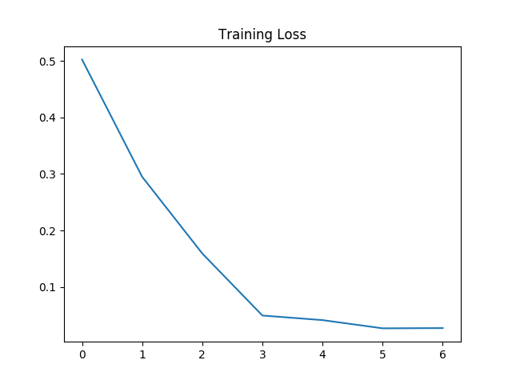
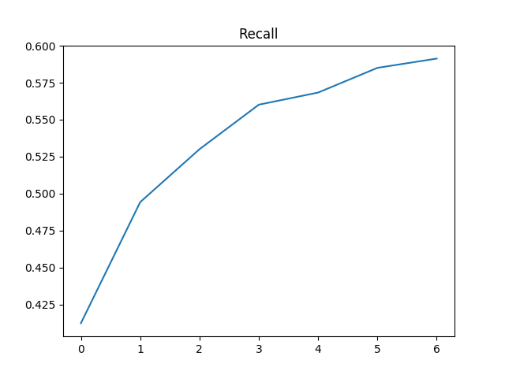
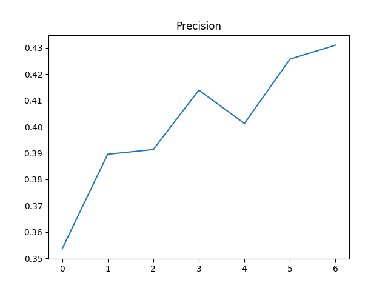
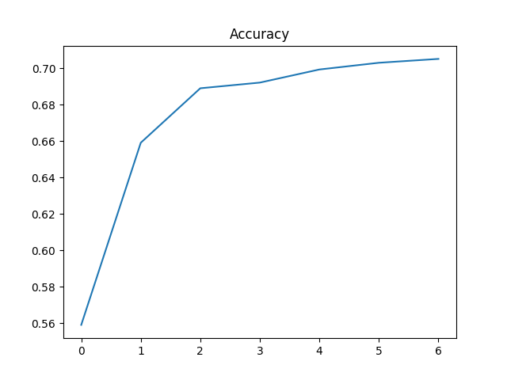

# Sexist Stereotype Classification

Due to the advent of social media, there is an increase in the number of interactions on the internet which may be classified as unhealthy or sexist. One of these platforms is Instagram. We use neural models to determine whether a comment or caption on Instagram is sexist or about sexism, and if so, what category it lies in.

